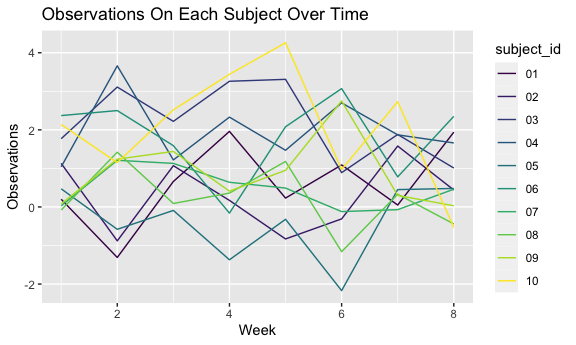

p8105\_hw5\_ac4964
================
AnMei Chen
11/15/2021

``` r
library(tidyverse)
```

    ## ── Attaching packages ─────────────────────────────────────── tidyverse 1.3.1 ──

    ## ✓ ggplot2 3.3.5     ✓ purrr   0.3.4
    ## ✓ tibble  3.1.5     ✓ dplyr   1.0.7
    ## ✓ tidyr   1.1.3     ✓ stringr 1.4.0
    ## ✓ readr   2.0.1     ✓ forcats 0.5.1

    ## ── Conflicts ────────────────────────────────────────── tidyverse_conflicts() ──
    ## x dplyr::filter() masks stats::filter()
    ## x dplyr::lag()    masks stats::lag()

``` r
knitr::opts_chunk$set(
  fig.width = 6,
  fig.asp = .6,
  out.width = "90%"
)

options(
  ggplot2.continuous.colour = "viridis" , 
  ggplot2.continuous.fill = "viridis"
)

scale_colour_discrete = scale_colour_viridis_d
scale_fill_discrete = scale_fill_viridis_d
```

## Problem 1

For this problem we are intested in data gathered and made publuc by
*The Washington Post* on homicides in 50 large U.S. cities. The code
chunk below imports and cleans the data.

victim\_age: char because of “Unknown” str\_c (): join multiple strings
into a single string — str\_c • string

To summarize within cities to obtain the total number of homicides and
the number of unsolved homicides : create a new variable “resolution”,
map Closed without arrest" and “Open/No arrest” with “unsolved” in
resolution and “Closed by arrest” with “solved” using case\_when()

case\_when(): vectorise multiple if\_else() statements.

count the city\_state and found a data entry issue in TulsaAL, therefore
we filter it out.

``` r
homicide_df = 
  read_csv("./data/homicide-data.csv", na = c("","Unknown")) %>% 
  mutate(
    city_state = str_c(city,state),
    resolution = case_when(
      disposition == "Closed without arrest" ~ "unsolved",
      disposition == "Open/No arrest" ~ "unsolved",
      disposition == "Closed by arrest" ~ "solved"
    )
  ) %>% 
  relocate(city_state) %>% 
  filter(city_state != "TulsaAL")
```

    ## Rows: 52179 Columns: 12

    ## ── Column specification ────────────────────────────────────────────────────────
    ## Delimiter: ","
    ## chr (8): uid, victim_last, victim_first, victim_race, victim_sex, city, stat...
    ## dbl (4): reported_date, victim_age, lat, lon

    ## 
    ## ℹ Use `spec()` to retrieve the full column specification for this data.
    ## ℹ Specify the column types or set `show_col_types = FALSE` to quiet this message.

prop.test can be used for testing the null that the proportions
(probabilities of success) in several groups are the same, or that they
equal certain given values. ex: prop.test(x = 5, n = 10) =&gt; 0.5

Let’s focus on Baltimore, MD.

``` r
baltimore_df = 
  homicide_df %>% 
  filter(city_state == "BaltimoreMD")

#resolution == "unsolved" only gives true or false, but summing this up will convert them to 0 or 1 so that we can get the number of unsolved homicides.
# n = total number of homicides in this time period

baltimore_summary = 
  baltimore_df %>% 
  summarize(
    unsolved = sum(resolution == "unsolved"),
    n = n()
  )

baltimore_test =
  prop.test(
    x = baltimore_summary %>% pull(unsolved),
    n = baltimore_summary %>% pull(n)
  )

# use broom::tidy() to organize the output from prop.test into a dataframe so that we can actually use the outputs later.

baltimore_test %>% 
  broom::tidy()
```

    ## # A tibble: 1 × 8
    ##   estimate statistic  p.value parameter conf.low conf.high method    alternative
    ##      <dbl>     <dbl>    <dbl>     <int>    <dbl>     <dbl> <chr>     <chr>      
    ## 1    0.646      239. 6.46e-54         1    0.628     0.663 1-sample… two.sided

Let’s try to iterate across cities! First off, write a function and test
it on few sample cities.

``` r
prop_test_function = function(city_df) {
  
  city_summary = 
    city_df %>% 
    summarize(
      unsolved = sum(resolution == "unsolved"),
      n = n()
    )

  city_test =
    prop.test(
     x = city_summary %>% pull(unsolved),
     n = city_summary %>% pull(n)
    )
  
  return(city_test)
  
}


prop_test_function(baltimore_df)
```

    ## 
    ##  1-sample proportions test with continuity correction
    ## 
    ## data:  city_summary %>% pull(unsolved) out of city_summary %>% pull(n), null probability 0.5
    ## X-squared = 239.01, df = 1, p-value < 2.2e-16
    ## alternative hypothesis: true p is not equal to 0.5
    ## 95 percent confidence interval:
    ##  0.6275625 0.6631599
    ## sample estimates:
    ##         p 
    ## 0.6455607

``` r
homicide_df %>% 
  filter(city_state == "AlbuquerqueNM") %>% 
  prop_test_function()
```

    ## 
    ##  1-sample proportions test with continuity correction
    ## 
    ## data:  city_summary %>% pull(unsolved) out of city_summary %>% pull(n), null probability 0.5
    ## X-squared = 19.114, df = 1, p-value = 1.232e-05
    ## alternative hypothesis: true p is not equal to 0.5
    ## 95 percent confidence interval:
    ##  0.3372604 0.4375766
    ## sample estimates:
    ##         p 
    ## 0.3862434

Now, lets iterate across all cities.

1.  nest uid:resolution and save them into new variable “data”
2.  Iteration: map everything in “data” and apply “prop\_test\_function”
    across “data”, then create a new variable named “test\_results”
3.  Iteration: map everything in “test\_results” and apply “broom::tidy”
    across “data”, then create a new variable named “tidy\_results”
4.  unest the test\_results to get the results

``` r
results_df = 
  homicide_df %>% 
  nest(data = uid:resolution) %>% 
  mutate(
    test_results = map(data,prop_test_function),
    tidy_results = map(test_results,broom::tidy)
  ) %>% 
  select(city_state,tidy_results) %>% 
  unnest(tidy_results) %>% 
  select(city_state, estimate, starts_with("conf"))
```

Try to make a plot showing estimates and confidence intervals.

``` r
results_df %>%
  mutate(
    city_state = fct_reorder(city_state,estimate)
  ) %>% 
  ggplot(aes(x = city_state, y = estimate)) +
  geom_point() +
  geom_errorbar(aes(ymin = conf.low, ymax = conf.high)) +
  theme(axis.text.x = element_text(angle = 90, vjust = 0.5, hjust = 1))
```


``` r
homicide_df %>% 
  group_by(city_state) %>% 
  summarize(
    unsolved = sum(resolution == "unsolved"),
    n = n()
  ) %>% 
  mutate(
    test_results = map2(unsolved,n,prop.test),
    tidy_results = map(test_results,broom::tidy)
  ) %>% 
  select(city_state,tidy_results) %>% 
  unnest(tidy_results) %>% 
  select(city_state, estimate, starts_with("conf"))
```

    ## # A tibble: 50 × 4
    ##    city_state    estimate conf.low conf.high
    ##    <chr>            <dbl>    <dbl>     <dbl>
    ##  1 AlbuquerqueNM    0.386    0.337     0.438
    ##  2 AtlantaGA        0.383    0.353     0.415
    ##  3 BaltimoreMD      0.646    0.628     0.663
    ##  4 Baton RougeLA    0.462    0.414     0.511
    ##  5 BirminghamAL     0.434    0.399     0.469
    ##  6 BostonMA         0.505    0.465     0.545
    ##  7 BuffaloNY        0.612    0.569     0.654
    ##  8 CharlotteNC      0.300    0.266     0.336
    ##  9 ChicagoIL        0.736    0.724     0.747
    ## 10 CincinnatiOH     0.445    0.408     0.483
    ## # … with 40 more rows

## Problem 2

create a dataframe containing all file names

``` r
file_list_df = 
  tibble(
    files = list.files("./data/zip_data/"))
```

Iterate over file names and read in data for each subject using
purrr::map and saving the result as a new variable in the dataframe

``` r
file_name_function = function(name) {
  
  file_name_df =
    tibble(
      file_name = paste("./data/zip_data/", name, sep = "")
    )
  
  return(file_name_df)
}

new_name = file_name_function(file_list_df[[1]])

file_df = 
  map(new_name, read_csv)
```

    ## Rows: 20 Columns: 8

    ## ── Column specification ────────────────────────────────────────────────────────
    ## Delimiter: ","
    ## dbl (8): week_1, week_2, week_3, week_4, week_5, week_6, week_7, week_8

    ## 
    ## ℹ Use `spec()` to retrieve the full column specification for this data.
    ## ℹ Specify the column types or set `show_col_types = FALSE` to quiet this message.

Tidy the result; manipulate file names to include control arm and
subject ID, make sure weekly observations are “tidy”, and do any other
tidying that’s necessary

``` r
file_list_df = 
  tibble(
    files = list.files("./data/zip_data/"))

new_file_list_df = 
  file_list_df %>% 
  separate(files, into = c("con_or_exp","subject_id"), "_") %>% 
  mutate(
    subject_id = str_replace(subject_id, ".csv","")
  )

tidy_results = 
  cbind(new_file_list_df,file_df) %>% 
  pivot_longer(
    file_name.week_1:file_name.week_8,
    names_prefix = "file_name.week_",
    names_to = "week",
    values_to = "observation"
  ) %>% 
  filter(con_or_exp == "con")
```

Make a spaghetti plot showing observations on each subject over time,
and comment on differences between groups.

``` r
tidy_results %>% 
  ggplot(aes(x = as.numeric(week), y = observation, color = subject_id)) +
  geom_line() +
  labs(
    title = "Observations On Each Subject Over Time",
    x = "Week",
    y = "Observations",
  ) 
```



## Problem 3

The code chunk below loads the iris dataset from the tidyverse package
and introduces some missing values in each column. The purpose of this
problem is to fill in those missing values.

``` r
library(tidyverse)
library(dplyr)

set.seed(10)

iris_with_missing = 
  iris %>% 
  map_df(~replace(.x, sample(1:150, 20), NA)) %>%
  mutate(Species = as.character(Species))
```

write a function

``` r
fill_in_character = 
  iris_with_missing %>% 
  mutate(
    Species = replace_na(Species, "virginica")
  )

fill_in_numbers = 
  iris_with_missing %>% 
  mutate(
    Sepal.Length = replace_na(Sepal.Length, mean(Sepal.Length, na.rm = TRUE))
  )
```

``` r
fill_in_missing = function(vector){
  
  if (is.numeric(vector)) {
    
    vector = replace_na(vector, mean(vector, na.rm = TRUE))
    
  }
  
  if (is.character(vector)) {
    
    vector = replace_na(vector, "virginica")
    
  }
  
  return(tibble(vector))
}

character_testing = fill_in_missing(iris_with_missing$Species)
number_testing = fill_in_missing(iris_with_missing$Petal.Width)
```

``` r
iris_with_missing %>% 
  nest(data = Sepal.Length:Species) %>% 
  mutate(
    data = map(data, fill_in_missing)
  ) %>% 
  unnest(data)
```

    ## # A tibble: 150 × 5
    ##    Sepal.Length Sepal.Width Petal.Length Petal.Width Species
    ##           <dbl>       <dbl>        <dbl>       <dbl> <chr>  
    ##  1          5.1         3.5          1.4         0.2 setosa 
    ##  2          4.9         3            1.4         0.2 setosa 
    ##  3          4.7         3.2          1.3         0.2 setosa 
    ##  4          4.6         3.1          1.5        NA   setosa 
    ##  5          5           3.6          1.4         0.2 setosa 
    ##  6          5.4         3.9          1.7         0.4 setosa 
    ##  7         NA           3.4          1.4         0.3 setosa 
    ##  8          5           3.4          1.5         0.2 setosa 
    ##  9          4.4         2.9          1.4         0.2 setosa 
    ## 10          4.9         3.1         NA           0.1 setosa 
    ## # … with 140 more rows
